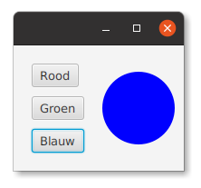
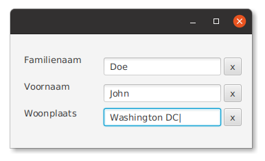

Objectgericht programmeren - week 5
===

### 3.5 Het pakket java.nio.file

**Oefening Langste Woord 3** Zelfde oefening als versie **1** van vorige week, maar lees het bestand van harde schijf. Plaats een kopie
ergens op je computer, bijvoorbeeld in `C:\Temp` (Windows) of `/tmp` (Unix / MacOS)

**Oefening Langste Woord 4** Zelfde oefening als versie **3**, maar gebruik Java streams.

### 3.8 XML met behulp van JDOM

**Oefening Books 1** Het bestand [books.xml](books.xml) bevat een kleine boekencataloog. Lees
die boeken in met behulp van JDOM. Vertrek van [deze broncode](books1-start.zip?raw=true)1. Die bevat reeds het
XML-bestand (in het class path) en het grootste gedeelte van het programma. Je hoeft enkel de methode `initCatalog` van `Main` te implementeren en dan
het programma uit te voeren - zie commentaar in de code. Als resultaat worden er 4 boeken afgedrukt op 8 lijnen - telkens de titel gevolgd door
de beschrijving. Let goed op dat er geen bijkomende lege lijnen worden afgedrukt!

### 3.9 JSON met behulp van Jackson

**Oefening Books 2** Het bestand [books.json](books.json) bevat dezelfde boekencataloog in JSON-formaat.
Vertrek nu van [deze broncode](books2-start.zip?raw=true) en lees de cataloog
in met behulp van Jackson. (Het inlezen zelf kan in één lijn.)

## 4.3 Gelijkaardige componenten

**Oefening Colors 1** Vertrek van [deze broncode](colors.zip?raw=true). Uitpakken in de `src`-map2.

Pas het programma aan zodat er maar één gebeurtenisverwerkende methode meer overblijft. Hecht daartoe *user data*
aan de knoppen en stel die in het FXML-bestand rechtstreeks in - zoals bij
`ButtonTwelve`.

## 4.4 Een eigen Button-klasse

**Oefening Colors 2** Pas de Colors-oefening aan3 zodat ze nu een eigen `ColorButton` gebruikt. Gebruik die
*color buttons* rechtstreeks in het FXML-bestand. Zorg eerst dat je programma werkt. Voeg dan
nog een knop toe die de cirkel doet paars kleuren. (Dit zou slecht één lijn in het FXML-bestand mogen vragen.)

## 4.5 Componenten opnieuw gebruiken

(Misschien pas volgende week …)

**Oefening ResettableTextField** Een *resettable text field* is een tekstveld met daar
onmiddellijk naast een knop waarmee je het veld kunt wissen. Er staan drie dergelijke componenten
in onderstaande schermafdruk

Schrijf een klasse `ResettableTextField` waarmee je een dergelijke component
kan voorstellen.
* Pas toe wat er in paragraaf §4.5 staat beschreven
* We geven je een klasse `ThreeTextFields`, met bijbehorend FXML-bestand, die deze component drie keer gebruikt.
* We geven je een FXML-bestand `ResettableTextField.fxml`
  dat de component beschrijft. Je kan dit bestand gebruiken, mits kleine aanpassingen,
  om je *resettable text field* op te bouwen.
* Je krijgt ook al een gedeelte van de broncode van `ResettableTextField` cadeau.

Vertrek van [deze broncode](rtf.zip?raw=true). Uitpakken in de `src`-map.

---

#### Oplossingen

Enkel wanneer het je zelf na een half uur nog niet lukt… (half uur per oefening!)

[Langste Woord 3](LangsteWoord3.java) |
[Langste Woord 4](LangsteWoord4.java) |
[Books 1](books1.zip?raw=true) |
[Books 2](books2.zip?raw=true) |
[Colors 1](colors1.zip?raw=true) |
[Colors 2](colors2.zip?raw=true) |
[ResettableTextField](rtf-opl.zip?raw=true)

---
#### Voetnoten

1 Omdat JDOM een *externe* bibliotheek is, hebben we de bestanden `pom.xml` en `module-info.java` moeten
aanpassen om die te gebruiken. Ook al behoort dit niet tot de leerstof, kan het nuttig zijn om die te bekijken
voor het geval

2 Deze (en latere) code gebruikt de klasse `be.ugent.objprog.core.FXMLMain` uit de cursusbroncode. We hebben die
voor de eenvoud in het ZIP-bestand opgenomen.

3 Als je IDEA gebruikt om een kopie van de `Colors1`-bestanden te maken en te hernoemen naar `Colors2…`, vergeet
dan niet ook de verwijzing naar de partnerklasse aan te passen in
het FXML-bestand.  je later een eigen project wil aanmaken waarin je JDOM nodig hebt.