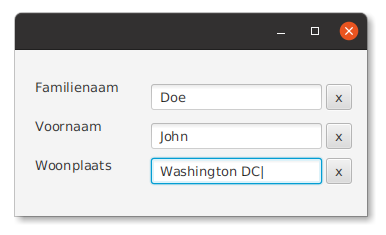

Objectgericht programmeren - week 6
===

## 4.4 Een eigen Button-klasse

**Oefening Colors 2** Pas de Colors-oefening aan1 zodat ze nu een eigen `ColorButton` gebruikt. Gebruik die
*color buttons* rechtstreeks in het FXML-bestand. Zorg eerst dat je programma werkt. Voeg dan
nog een knop toe die de cirkel doet paars kleuren. (Dit zou slecht één lijn in het FXML-bestand mogen vragen.)

## 4.5 Componenten opnieuw gebruiken

**Oefening ResettableTextField** Een *resettable text field* is een tekstveld met daar
onmiddellijk naast een knop waarmee je het veld kunt wissen. Er staan drie dergelijke componenten
in onderstaande schermafdruk

Schrijf een klasse `ResettableTextField` waarmee je een dergelijke component
kan voorstellen.
* Pas toe wat er in paragraaf §4.5 staat beschreven
* We geven je een klasse `ThreeTextFields`, met bijbehorend FXML-bestand, die deze component drie keer gebruikt.
* We geven je een FXML-bestand `ResettableTextField.fxml`
  dat de component beschrijft. Je kan dit bestand gebruiken, mits kleine aanpassingen,
  om je *resettable text field* op te bouwen.
* Je krijgt ook al een gedeelte van de broncode van `ResettableTextField` cadeau.

Vertrek van [deze broncode](rtf.zip?raw=true). Uitpakken in de `src`-map.

## Wordt nog aangevuld!

---

#### Oplossingen

Enkel wanneer het je zelf na een half uur nog niet lukt… (half uur per oefening!)

[Colors 2](colors2.zip?raw=true) |
[ResettableTextField](rtf-opl.zip?raw=true)

1 Als je IDEA gebruikt om een kopie van de `Colors1`-bestanden te maken en te hernoemen naar `Colors2…`, vergeet
dan niet ook de verwijzing naar de partnerklasse aan te passen in
het FXML-bestand.  je later een eigen project wil aanmaken waarin je JDOM nodig hebt.